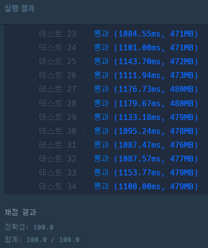

> 최초작성 : 2022.11.28

## ******Level2 - 귤 고르기**** (kotlin)**

 [코딩테스트 연습 - 귤 고르기](https://school.programmers.co.kr/learn/courses/30/lessons/138476)

### **문제 설명**
경화는 과수원에서 귤을 수확했습니다. 경화는 수확한 귤 중 'k'개를 골라 상자 하나에 담아 판매하려고 합니다. 그런데 수확한 귤의 크기가 일정하지 않아 보기에 좋지 않다고 생각한 경화는 귤을 크기별로 분류했을 때 서로 다른 종류의 수를 최소화하고 싶습니다.

예를 들어, 경화가 수확한 귤 8개의 크기가 [1, 3, 2, 5, 4, 5, 2, 3] 이라고 합시다. 경화가 귤 6개를 판매하고 싶다면, 크기가 1, 4인 귤을 제외한 여섯 개의 귤을 상자에 담으면, 귤의 크기의 종류가 2, 3, 5로 총 3가지가 되며 이때가 서로 다른 종류가 최소일 때입니다.

경화가 한 상자에 담으려는 귤의 개수 k와 귤의 크기를 담은 배열 tangerine이 매개변수로 주어집니다. 경화가 귤 k개를 고를 때 크기가 서로 다른 종류의 수의 최솟값을 return 하도록 solution 함수를 작성해주세요.

### **제한사항**
- 1 ≤ k ≤ tangerine의 길이 ≤ 100,000
- 1 ≤ tangerine의 원소 ≤ 10,000,000

### **​입출력 예**
| k | tangerine                | result |
|---|--------------------------|--------|
| 6 | [1, 3, 2, 5, 4, 5, 2, 3] | 3      |
| 4 | [1, 3, 2, 5, 4, 5, 2, 3] | 2      |
| 2 | [1, 1, 1, 1, 2, 2, 2, 3] | 1      |

### **입출력 예 설명**

#### 입출력 예 #1
본문에서 설명한 예시입니다.

#### 입출력 예 #2
경화는 크기가 2인 귤 2개와 3인 귤 2개 또는 2인 귤 2개와 5인 귤 2개 또는 3인 귤 2개와 5인 귤 2개로 귤을 판매할 수 있습니다. 이때의 크기 종류는 2가지로 이 값이 최소가 됩니다.

#### 입출력 예 #3
경화는 크기가 1인 귤 2개를 판매하거나 2인 귤 2개를 판매할 수 있습니다. 이때의 크기 종류는 1가지로, 이 값이 최소가 됩니다.

<br>

---

<br>

### _**나의 풀이**_

1\. tangerine 원소의 최댓값은 10,000,000이므로 그 크기만큼의 배열을 생성한다.

2\. 각 숫자의 index에 해당 숫자의 개수를 계산한다.

3\. 해당 배열을 0이 아닌 값들만 filter하고 내림차순으로 정렬한다.

4\. 배열의 처음부터 k 숫자만큼 귤을 빼낸 횟수를 리턴한다.


```kt
class PickingTangerines {
    fun solution(k: Int, tangerine: IntArray): Int {
        var index = 0
        var sum = 0
        var count = Array(100000001) { 0 }

        tangerine.forEach { count[it] += 1 }

        count = count.filter { it != 0 }.toList().sortedDescending().toTypedArray()

        while (true) {
            index++
            if (count[index-1] < k-sum) sum += count[index-1]
            else break
        }

        return index
    }
}
```

    통과는 했지만 시간이 터지기 직전이다...
    제대로 된 해결 방식은 아닌 것 같다.


<br>

---

<br>

### _**다른 사람의 풀이1**_

1\. groupBy 함수를 사용하여 귤을 각 그룹 별로 분류한다.

2\. 해당 값들의 사이즈를 내림차순으로 정렬한다.

3\. fold 함수를 통해 k값만큼 개수를 계산 후 리턴한다.

```kt
class Solution {
    fun solution(k: Int, tangerine: IntArray): Int {
        return tangerine.groupBy { it }
            .values
            .sortedByDescending { it.size }
            .map { Pair(0, it.size) }
            .fold(Pair(0, 0)) { acc, (_, size) ->
                if (acc.second >= k) acc else Pair(acc.first + 1, acc.second + size)
            }
            .first
    }
}
```

Kotlin 컬렉션에는 컬랙션 내의 데이터를 모두 모으는(accumulate) 함수인 reduce()와 fold()가 있다.
* reduce(): 초기값이 없이 첫번째 요소(element)로 시작
* fold(): 지정해 준 초기값으로 시작

    나의 풀이보다 시간이 1/3로 줄었다. 역시 사람들의 지혜란...