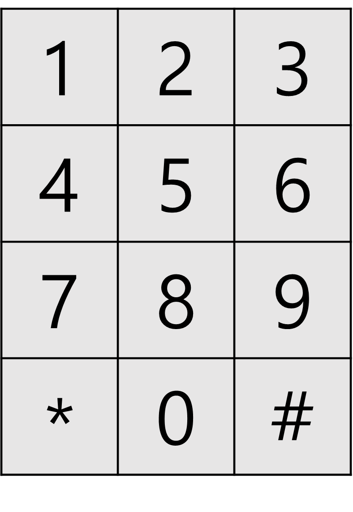

> 최초작성 : 2022.11.27

## ******Level3 - 숫자 타자 대회**** (kotlin)**

 [코딩테스트 연습 - 숫자 타자 대회](https://school.programmers.co.kr/learn/courses/30/lessons/136797)

### **문제 설명**


위와 같은 모양으로 배열된 숫자 자판이 있습니다. 숫자 타자 대회는 이 동일한 자판을 사용하여 숫자로만 이루어진 긴 문자열을 누가 가장 빠르게 타이핑하는지 겨루는 대회입니다.

대회에 참가하려는 민희는 두 엄지 손가락을 이용하여 타이핑을 합니다. 민희는 항상 왼손 엄지를 4 위에, 오른손 엄지를 6 위에 두고 타이핑을 시작합니다. 엄지 손가락을 움직여 다음 숫자를 누르는 데에는 일정 시간이 듭니다. 민희는 어떤 두 숫자를 연속으로 입력하는 시간 비용을 몇몇 가중치로 분류하였습니다.

	• 이동하지 않고 제자리에서 다시 누르는 것은 가중치가 1입니다.
	• 상하좌우로 인접한 숫자로 이동하여 누르는 것은 가중치가 2입니다.
	• 대각선으로 인접한 숫자로 이동하여 누르는 것은 가중치가 3입니다.
	• 같지 않고 인접하지 않은 숫자를 누를 때는 위 규칙에 따라 가중치 합이 최소가 되는 경로를 따릅니다.

예를 들어 1 위에 있던 손가락을 0 으로 이동하여 누르는 것은 2 + 2 + 3 = 7 만큼의 가중치를 갖습니다.
단, 숫자 자판은 버튼의 크기가 작기 때문에 같은 숫자 버튼 위에 동시에 두 엄지 손가락을 올려놓을 수 없습니다. 즉, 어떤 숫자를 눌러야 할 차례에 그 숫자 위에 올려져 있는 손가락이 있다면 반드시 그 손가락으로 눌러야 합니다.

숫자로 이루어진 문자열 numbers가 주어졌을 때 최소한의 시간으로 타이핑을 하는 경우의 가중치 합을 return 하도록 solution 함수를 완성해주세요.


### **제한사항**
- 1 ≤ numbers의 길이 ≤ 100,000
- numbers는 아라비아 숫자로만 이루어진 문자열입니다.

### **​입출력 예**
| numbers | result |
|---------|--------|
| "1756"  | 10     |
| "5123"  | 8      |

### **입출력 예 설명**

#### 입출력 예 #1
왼손 엄지로 17, 오른손 엄지로 56을 누르면 가중치 10으로 최소입니다.

#### 입출력 예 #2
오른손 엄지로 5, 왼손 엄지로 123을 누르거나 오른손 엄지로 5, 왼손 엄지로 1, 오른손 엄지로 23을 누르면 가중치 8로 최소입니다.


<br>

---

<br>

### _**나의 풀이1**_

1\. 각 숫자 키패드로 이동할 때의 가중치를 직접 구하는 함수 key()를 구현함

2\. 가중치, 왼손위치, 오른손위치 를 저장할 Stack을 생성

3\. 이동할 숫자마다 왼손과 오른손 각각의 가중치를 구하고, 이동된 값을 새로운 Stack에 저장

4\. 반복문이 끝나면 원래 Stack에 새로운 Stack을 엎어침

5\. 마지막 숫자로 이동하는 경우, 그 떄 그 때의 최솟값을 바로 구해줌


```kt
import java.util.Stack
import kotlin.math.abs

class Solution {
    fun solution(numbers: String): Int {
        var answer = Int.MAX_VALUE

        var weights = Stack<Triple<Int, IntArray, IntArray>>()
        weights.add(Triple(0, intArrayOf(1,0), intArrayOf(1,2)))

        numbers.forEachIndexed { index, c ->
            val subWeights = Stack<Triple<Int, IntArray, IntArray>>()

            while (weights.isNotEmpty()) {
                val w = weights.pop()

                val leftWeight = key(c.toString().toInt(), w.second)
                val rightWeight = key(c.toString().toInt(), w.third)

                if (index == numbers.lastIndex) {
                    val max = if (leftWeight.first <= rightWeight.first) leftWeight.first
                    else rightWeight.first
                    if (w.first + max < answer) answer = w.first + max
                } else {
                    if (leftWeight.first == 1) {
                        subWeights.add(Triple(w.first + leftWeight.first, leftWeight.second, w.third))
                    } else if (rightWeight.first == 1) {
                        subWeights.add(Triple(w.first + rightWeight.first, w.second, rightWeight.second))
                    } else {
                        subWeights.add(Triple(w.first + leftWeight.first, leftWeight.second, w.third))
                        subWeights.add(Triple(w.first + rightWeight.first, w.second, rightWeight.second))
                    }
                }
            }

            weights = subWeights
        }

        return answer
    }

    private fun key(number: Int, hand: IntArray): Pair<Int, IntArray> {
        val position = when (number) {
            1 -> intArrayOf(0,0)
            2 -> intArrayOf(0,1)
            3 -> intArrayOf(0,2)
            4 -> intArrayOf(1,0)
            5 -> intArrayOf(1,1)
            6 -> intArrayOf(1,2)
            7 -> intArrayOf(2,0)
            8 -> intArrayOf(2,1)
            9 -> intArrayOf(2,2)
            else -> intArrayOf(3,1)
        }

         val weight = when (position[0]) {
            hand[0] -> {
                when (abs(position[1]-hand[1])) {
                    0 -> 1
                    1 -> 2
                    2 -> 4
                    else -> 0
                }
            }
            hand[0]+1, hand[0]-1 -> {
                when (abs(position[1]-hand[1])) {
                    0 -> 2
                    1 -> 3
                    2 -> 5
                    else -> 0
                }
            }
            hand[0]+2, hand[0]-2 -> {
                when (abs(position[1]-hand[1])) {
                    0 -> 4
                    1 -> 5
                    2 -> 6
                    else -> 0
                }
            }
            hand[0]+3, hand[0]-3 -> {
                when (abs(position[1]-hand[1])) {
                    0 -> 6
                    1 -> 7
                    else -> 0
                }
            }
            else -> 0
        }

        return Pair(weight, position)
    }
}

```

##### 테스트케이스 16~20번. 메모리 초과 실패.

<br>

---

<br>

### _**나의 풀이2**_

1\. 각 숫자마다의 가중치를 구한 map 배열 생성

2\. [왼손][오른손]의 위치를 index로 갖는 이중 배열 weights를 생성

3\. weights에 그 떄 그때의 가중치를 구해서 올려줌

4\. 기존에 있던 weights는 새로 저장된 subWeights로 엎어침

5\. 같은 손 위치에 있어도 가중치가 다른 경우가 있기 때문에 최솟값으로 저장함


```kt
import java.lang.Integer.min

class Solution {
    fun solution(numbers: String): Int {
        var answer = Int.MAX_VALUE

        val map = arrayOf(
            arrayOf(1, 7, 6, 7, 5, 4, 5, 3, 2, 3),
            arrayOf(7, 1, 2, 4, 2, 3, 5, 4, 5, 6),
            arrayOf(6, 2, 1, 2, 3, 2, 3, 5, 4, 5),
            arrayOf(7, 4, 2, 1, 5, 3, 2, 6, 5, 4),
            arrayOf(5, 2, 3, 5, 1, 2, 4, 2, 3, 5),
            arrayOf(4, 3, 2, 3, 2, 1, 2, 3, 2, 3),
            arrayOf(5, 5, 3, 2, 4, 2, 1, 5, 3, 2),
            arrayOf(3, 4, 5, 6, 2, 3, 5, 1, 2, 4),
            arrayOf(2, 5, 4, 5, 3, 2, 3, 2, 1, 2),
            arrayOf(3, 6, 5, 4, 5, 3, 2, 4, 2, 1),
        )

        var weights = Array(10) { Array<Int?>(10) {null} }
        weights[4][6] = 0

        numbers.forEachIndexed { index, c ->
            val subWeights = Array(10) { Array<Int?>(10) { null } }
            val num = c.toString().toInt()

            weights.forEachIndexed { left, ints ->
                ints.forEachIndexed { right, i ->
                    if (i != null) {
                        if (index == numbers.lastIndex) {
                            val max =
                                if (map[left][num] <= map[right][num]) map[left][num]
                                else map[right][num]
                            if (i + max < answer) answer = i + max
                        } else {
                            if (left == num) {
                                val weight = i + 1
                                if (subWeights[num][right] != null) {
                                    subWeights[num][right] = min(subWeights[num][right]!!, weight)
                                } else {
                                    subWeights[num][right] = weight
                                }
                            } else if (right == num) {
                                val weight = i + 1
                                if (subWeights[left][num] != null) {
                                    subWeights[left][num] = min(subWeights[left][num]!!, weight)
                                } else {
                                    subWeights[left][num] = weight
                                }
                            } else {
                                val leftWeight = i + map[left][num]
                                if (subWeights[num][right] != null) {
                                    subWeights[num][right] = min(subWeights[num][right]!!, leftWeight)
                                } else {
                                    subWeights[num][right] = leftWeight
                                }

                                val rightWeight = i + map[right][num]
                                if (subWeights[left][num] != null) {
                                    subWeights[left][num] = min(subWeights[left][num]!!, rightWeight)
                                } else {
                                    subWeights[left][num] = rightWeight
                                }
                            }
                        }
                    }
                }
            }

            weights = subWeights
        }

        return answer
    }
}
```

##### 통과는 했지만 너무 복잡한 방법으로 푼 것 같다.
##### 코드를 좀 더 간결하게 줄이고 싶은데 예외사항 처리 떄문에 못했다.