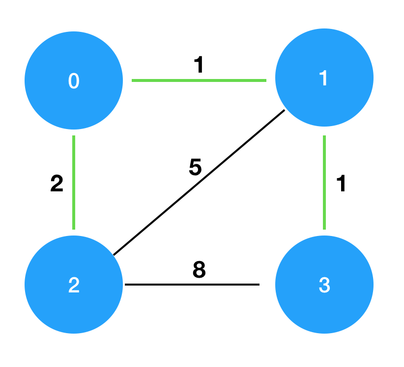

> 최초작성 : 2022.12.31

## ******Level3 - 섬 연결하기**** (kotlin)**

 [코딩테스트 연습 - 섬 연결하기](https://school.programmers.co.kr/learn/courses/30/lessons/42861)

### **문제 설명**
n개의 섬 사이에 다리를 건설하는 비용(costs)이 주어질 때, 최소의 비용으로 모든 섬이 서로 통행 가능하도록 만들 때 필요한 최소 비용을 return 하도록 solution을 완성하세요.

다리를 여러 번 건너더라도, 도달할 수만 있으면 통행 가능하다고 봅니다. 예를 들어 A 섬과 B 섬 사이에 다리가 있고, B 섬과 C 섬 사이에 다리가 있으면 A 섬과 C 섬은 서로 통행 가능합니다.

### **제한사항**
- 섬의 개수 n은 1 이상 100 이하입니다.
- costs의 길이는 ((n-1) * n) / 2이하입니다.
- 임의의 i에 대해, costs[i][0] 와 costs[i] [1]에는 다리가 연결되는 두 섬의 번호가 들어있고, costs[i] [2]에는 이 두 섬을 연결하는 다리를 건설할 때 드는 비용입니다.
- 같은 연결은 두 번 주어지지 않습니다. 또한 순서가 바뀌더라도 같은 연결로 봅니다. 즉 0과 1 사이를 연결하는 비용이 주어졌을 때, 1과 0의 비용이 주어지지 않습니다.
- 모든 섬 사이의 다리 건설 비용이 주어지지 않습니다. 이 경우, 두 섬 사이의 건설이 불가능한 것으로 봅니다.
- 연결할 수 없는 섬은 주어지지 않습니다.

### **입출력 예**
| n | costs                                     | return |
|:--|:------------------------------------------|:-------|
| 4 | [[0,1,1],[0,2,2],[1,2,5],[1,3,1],[2,3,8]] | 4      |

### **입출력 예 설명**
costs를 그림으로 표현하면 다음과 같으며, 이때 초록색 경로로 연결하는 것이 가장 적은 비용으로 모두를 통행할 수 있도록 만드는 방법입니다.



<br>

---

<br>

### _**나의 풀이**_

1\. 가중치를 기준으로 오름차순 정렬한다.

2\. 가장 작은 가중치부터 연결을 시작한다.

3\. 섬이 연결되면 작은 번호를 가진 섬의 번호로 각 섬의 root를 변경해준다.
- 변경되는 root의 번호를 가진 root 모두 새로 변경해준다.
    - ex. 섬1, 섬2, 섬3 은 모두 섬1을 root로 가지고 있다.
    - 그 때 섬0 - 섬3 이 연결된다.
    - root는 섬0으로 초기화되며 섬1,섬2 또한 섬0을 root로 갖는다.

4\. 다음 연결에서 두개의 섬의 부모가 다르면 2번과 3번을 반복한다.

5\. 연결한 횟수가 n-1일 경우 가중치를 리턴한다.

```kt
class Solution {
    fun solution(n: Int, costs: Array<IntArray>): Int {
        costs.sortBy { it[2] }

        val root = IntArray(n) { it }

        var cost = 0
        var cnt = 0

        costs.forEach {
            if (root[it[0]] != root[it[1]]) {
                val first = Math.min( root[it[0]], root[it[1]] )
                val second = Math.max( root[it[0]], root[it[1]] )

                for (i in root.indices) {
                    if (root[i] == second) {
                        root[i] = first
                    }
                }

                cost += it[2]
                cnt++

                if (cnt == n-1) {
                    return cost
                }
            }
        }

        return cost
    }
}
```

##### 처음에는 그냥 최소 비용으로 한붓그리기처럼 연결하는 줄 알았다.
##### 25점이 뜨고 여러가지 테스트 케이스를 돌려보고 문제를 잘못 해석했다는 것을 깨달았다.
##### 질문하기를 통해 '크루스칼 알고리즘'을 이용하여 풀어야 한다는 힌트를 얻었다.
##### 위 알고리즘의 원리를 찾아본 후 내 입맛대로 적용해 보았다.