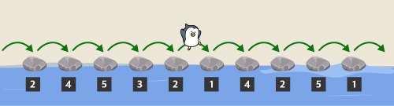
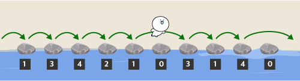
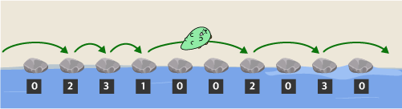
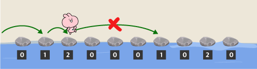
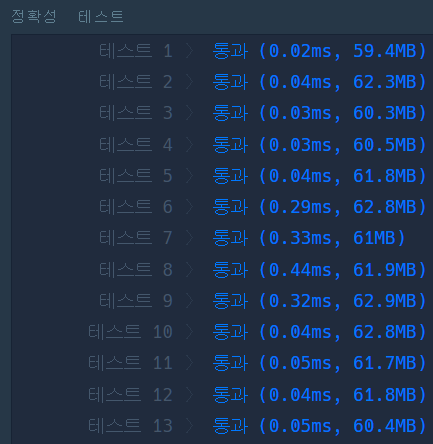
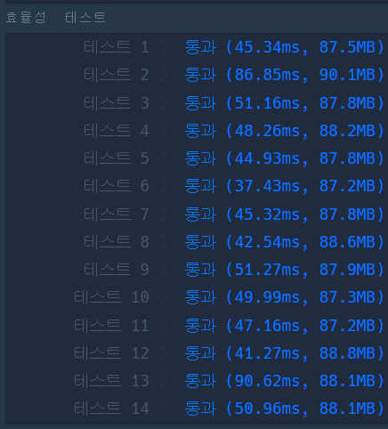

> 최초작성 : 2023.02.03

## ******Level3 - 징검다리 건너기**** (kotlin)**

 [코딩테스트 연습 - 징검다리 건너기](https://school.programmers.co.kr/learn/courses/30/lessons/64062)

### **문제 설명**
카카오 초등학교의 "니니즈 친구들"이 "라이언" 선생님과 함께 가을 소풍을 가는 중에 징검다리가 있는 개울을 만나서 건너편으로 건너려고 합니다. "라이언" 선생님은 "니니즈 친구들"이 무사히 징검다리를 건널 수 있도록 다음과 같이 규칙을 만들었습니다.

- 징검다리는 일렬로 놓여 있고 각 징검다리의 디딤돌에는 모두 숫자가 적혀 있으며 디딤돌의 숫자는 한 번 밟을 때마다 1씩 줄어듭니다.
- 디딤돌의 숫자가 0이 되면 더 이상 밟을 수 없으며 이때는 그 다음 디딤돌로 한번에 여러 칸을 건너 뛸 수 있습니다.
- 단, 다음으로 밟을 수 있는 디딤돌이 여러 개인 경우 무조건 가장 가까운 디딤돌로만 건너뛸 수 있습니다.
	
"니니즈 친구들"은 개울의 왼쪽에 있으며, 개울의 오른쪽 건너편에 도착해야 징검다리를 건넌 것으로 인정합니다.
"니니즈 친구들"은 한 번에 한 명씩 징검다리를 건너야 하며, 한 친구가 징검다리를 모두 건넌 후에 그 다음 친구가 건너기 시작합니다.
디딤돌에 적힌 숫자가 순서대로 담긴 배열 stones와 한 번에 건너뛸 수 있는 디딤돌의 최대 칸수 k가 매개변수로 주어질 때, 최대 몇 명까지 징검다리를 건널 수 있는지 return 하도록 solution 함수를 완성해주세요.

### **제한사항**
- 징검다리를 건너야 하는 니니즈 친구들의 수는 무제한 이라고 간주합니다.
- stones 배열의 크기는 1 이상 200,000 이하입니다.
- stones 배열 각 원소들의 값은 1 이상 200,000,000 이하인 자연수입니다.
- k는 1 이상 stones의 길이 이하인 자연수입니다.

### **입출력 예**
| stones |	k |	result |
|---|---|---|
|[2, 4, 5, 3, 2, 1, 4, 2, 5, 1]	| 3	| 3|

### **입출력 예에 대한 설명**

#### **입출력 예 #1**

첫 번째 친구는 다음과 같이 징검다리를 건널 수 있습니다.



첫 번째 친구가 징검다리를 건넌 후 디딤돌에 적힌 숫자는 아래 그림과 같습니다.
두 번째 친구도 아래 그림과 같이 징검다리를 건널 수 있습니다.



두 번째 친구가 징검다리를 건넌 후 디딤돌에 적힌 숫자는 아래 그림과 같습니다.
세 번째 친구도 아래 그림과 같이 징검다리를 건널 수 있습니다.



세 번째 친구가 징검다리를 건넌 후 디딤돌에 적힌 숫자는 아래 그림과 같습니다.
네 번째 친구가 징검다리를 건너려면, 세 번째 디딤돌에서 일곱 번째 디딤돌로 네 칸을 건너뛰어야 합니다. 하지만 k = 3 이므로 건너뛸 수 없습니다.



따라서 최대 3명이 디딤돌을 모두 건널 수 있습니다.


<br>

---

<br>

### _**나의 풀이 1**_

1. 한명이 지나갈 때마다 모든 값을 -1
2. 0이 k개 이상 모이면 break
3. 지금까지 건넌 인원수를 return

```kt
class Solution {
    fun solution(stones: IntArray, k: Int): Int {
        var answer = 0

        while(true) {
            var num = 0

            run loop@ {
                stones.forEachIndexed { index, i ->
                    if (i == 0) {
                        num++
                    } else {
                        num = 0
                        stones[index] = i-1
                    }
                    if (num >= k) return@loop
                }
            }

            if (num >= k) break
            else answer++
        }

        return answer
    }
}
```

##### 문제에서 요구한대로 풀었음
##### 정확성 테스트는 모두 완벽하게 통과했다.
##### 하지만 역시나 효율성에서 모두 나가리!


<br>

---

<br>

### _**나의 풀이 2**_

1. 배열에서 k개의 모든 조합을 구함
2. 각 조합에서의 최댓값 중 가장 작은 값을 리턴

```kt
class Solution {
    fun solution(stones: IntArray, k: Int): Int {
        var answer = Int.MAX_VALUE

        for (i in 0 until stones.size-k+1) {
            var max = stones[i]
            for (j in i+1 until i+k) {
                if (stones[j] > max) max = stones[j]
            }
            if (max < answer) answer = max
        }

        return answer
    }
}
```

##### 이 방법은 효율성을 1개 성공했다.

<br>

---

<br>

### _**나의 풀이 3**_

1. 문제 제한조건에서 최솟값은 1, 최댓값은 200,000,000 이다.
2. 위 제한조건을 사용하여 이분법으로 계산한다.
3. 최솟값과 최댓값의 중간값을 찾고, 중간값의 숫자만큼 디딤돌 숫자를 제거한다.
    - 연속되는 0보다 작은 디딤돌이 k만큼 있을 경우 max 값을 mid로 변경
        - mid 값은 정답에 충족하므로 answer로 대체
    - 연속되는 0보다 작은 디딤돌이 k만큼이 안될 경우 min 값을 mid로 변경
4. min이나 max 값이 mid와 같아지면 반복문 종료 후 answer 값 리턴

```kt
class Solution {
    fun solution(stones: IntArray, k: Int): Int {
        var answer = 0

        var max = 200000000
        var min = 1
        var mid = (max+min)/2

        while (true) {
            var cnt = 0
            val newStones = stones.clone()
            for (i in stones.indices) {
                newStones[i] = stones[i]-mid

                if (newStones[i] <= 0) cnt++
                else cnt = 0

                if (cnt == k) break
            }

            if (cnt == k) {
                answer = mid
                max = mid
            } else {
                min = mid
            }
            mid = (min+max) / 2

            if (max == mid || min == mid) break
        }

        return answer
    }
}
```

##### '질문하기'를 참고하여 '이분법'을 사용하여 풀었고, 드디어 통과했다.


