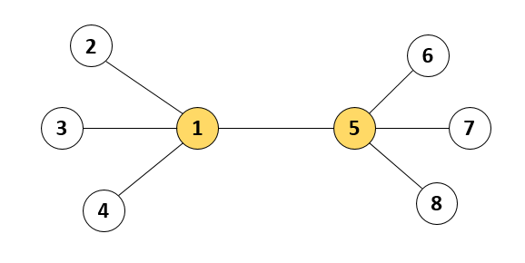
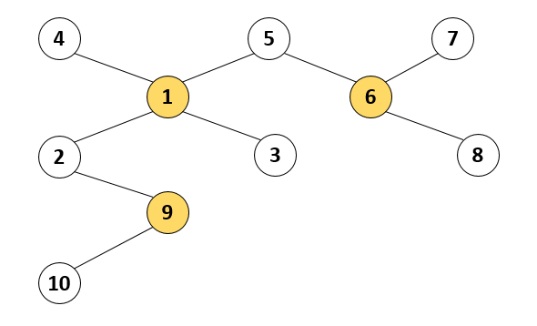
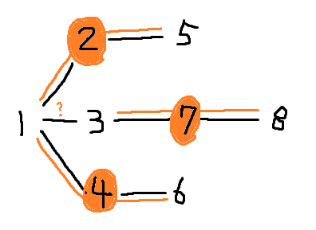

> 최초작성 : 2023.02.11

## ******Level3 - 등대**** (kotlin)**

 [코딩테스트 연습 - 등대](https://school.programmers.co.kr/learn/courses/30/lessons/133500)

### **문제 설명**
인천 앞바다에는 1부터 n까지 서로 다른 번호가 매겨진 등대 n개가 존재합니다. 등대와 등대 사이를 오가는 뱃길이 n-1개 존재하여, 어느 등대에서 출발해도 다른 모든 등대까지 이동할 수 있습니다. 등대 관리자 윤성이는 전력을 아끼기 위하여, 이 중 몇 개의 등대만 켜 두려고 합니다. 하지만 등대를 아무렇게나 꺼버리면, 뱃길을 오가는 배들이 위험할 수 있습니다. 한 뱃길의 양쪽 끝 등대 중 적어도 하나는 켜져 있도록 등대를 켜 두어야 합니다.

예를 들어, 아래 그림과 같이 등대 8개와 7개의 뱃길들이 있다고 합시다. 이 경우 1번 등대와 5번 등대 두 개만 켜 두어도 모든 뱃길은 양쪽 끝 등대 중 하나가 켜져 있으므로, 배들은 안전하게 운항할 수 있습니다.



등대의 개수 n과 각 뱃길이 연결된 등대의 번호를 담은 이차원 배열 lighthouse가 매개변수로 주어집니다. 윤성이가 켜 두어야 하는 등대 개수의 최솟값을 return 하도록 solution 함수를 작성해주세요.

### **제한사항**
- 2 ≤ n ≤ 100,000
- lighthouse의 길이 = n – 1
    - lighthouse 배열의 각 행 [a, b]는 a번 등대와 b번 등대가 뱃길로 연결되어 있다는 의미입니다.
        - 1 ≤ a ≠ b ≤ n
        - 모든 등대는 서로 다른 등대로 이동할 수 있는 뱃길이 존재하도록 입력이 주어집니다.

### **입출력 예**
n	lighthouse	result
8	[[1, 2], [1, 3], [1, 4], [1, 5], [5, 6], [5, 7], [5, 8]]	2
10	[[4, 1], [5, 1], [5, 6], [7, 6], [1, 2], [1, 3], [6, 8], [2, 9], [9, 10]]	3

### **입출력 예 설명**
#### 입출력 예 #1
본문에서 설명한 예시입니다.

#### 입출력 예 #2
뱃길은 아래 그림과 같이 연결되어 있습니다. 윤성이가 이중 1, 6, 9번 등대 3개만 켜 두어도 모든 뱃길은 양쪽 끝 등대 중 하나가 켜져 있게 되고, 이때의 등대 개수 3개가 최소가 됩니다.




<br>

---

<br>

### _**나의 풀이 1 (실패)**_

1. 연결된 등대가 1개 밖에 없는 경우 해당 등대의 불빛을 켠다.
2. 메모리 초과 방지를 위해 set을 사용

```kt
class Solution {
    fun solution(n: Int, lighthouse: Array<IntArray>): Int {
        val graph = Array(n+1) { mutableSetOf<Int>() }
        val isLights = mutableSetOf<Int>()

        lighthouse.forEach {
            graph[it[0]].add(it[1])
            graph[it[1]].add(it[0])
        }

        graph.forEach {
            if (it.size == 1) isLights.add(it.first())
        }

        return isLights.size
    }
}
```

##### 택도 없는 풀이법. 반례가 너무 많다.

<br>

---

<br>

### _**나의 풀이 2 (실패)**_

1. 1번을 보완하여 인접한 등대가 꺼져있으면 불을 켜줌

```kt
class Solution {
    fun solution(n: Int, lighthouse: Array<IntArray>): Int {
        val graph = Array(n+1) { mutableSetOf<Int>() }
        val isLights = Array<Boolean?>(n+1) { null }

        lighthouse.forEach {
            graph[it[0]].add(it[1])
            graph[it[1]].add(it[0])
        }

        graph.forEach {
            if (it.size == 1) {
                isLights[it.first()] = true
            }
        }

        graph.forEachIndexed { index, sets ->
            sets.forEach { i ->
                if (isLights[index] == null && isLights[i] == null) {
                    isLights[index] = true
                }
            }
        }

        return isLights.filter { it == true }.size
    }
}
```

##### 반례는 아래 그림과 같다.



<br>

---

<br>

### _**나의 풀이 3 (실패)**_

1. 본인 혹은 연결되어 있는 등대의 불이 켜져있는지 체크할 isLights 선언 (불이 켜지면 set에서 빠짐)
2. 연결되어 있는 등대들을 나타내는 graph
3. Graph를 돌다가 연결되어 있는 등대가 하나인 경우 반대편 등대를 켬
    - Graph에서 해당 등대와 반대편 등대가 있는 모든 경우를 제거함
    - isLight에서 해당 등대와 반대편 등대를 제거함
4. isLights가 모두 없어질 때까지 3번을 반복

```kt
class Solution {
    fun solution(n: Int, lighthouse: Array<IntArray>): Int {
        val graph = Array(n+1) { mutableSetOf<Int>() }
        val noLights = mutableSetOf<Int>()
        var count = 0

        lighthouse.forEach {
            graph[it[0]].add(it[1])
            graph[it[1]].add(it[0])

            noLights.add(it[0])
            noLights.add(it[1])
        }

        while (noLights.size != 0) {
            graph.forEachIndexed { index, ints ->
                if (ints.size == 1) {
                    val first = ints.first()

                    count++

                    noLights.remove(first)
                    graph[first].forEach { i ->
                        graph[i].remove(first)
                        noLights.remove(i)
                    }

                    graph[first].clear()
                }
            }
        }

        return count
    }
}
```

##### 두번째 문제 풀이보다는 점수가 높아졌지만 반례는 같다.


<br>

---

<br>

### _**나의 풀이 4 (성공)**_

1. 등대 number에 연결되어 있는 등대들을 나타내기 위해 Map을 사용 (등대 Number가 Key값)
2. N번 등대에 연결되어 있는 등대가 1개라면 반대편 등대에 불을 켬
    - N번 등대의 반대편 등대 R에 대응되는 등대 제거 (Map에서 R의 값 삭제)
    - R 등대에 연결된 등대의 리스트에서 모두 R을 제거
    - N번 등대의 모든 값 제거 (Map에서 N의 값 삭제)
3. Map이 하나도 남지 않을 때까지 2번 반복

```kt
class Solution {
    fun solution(n: Int, lighthouse: Array<IntArray>): Int {
        val graph = mutableMapOf<Int, MutableSet<Int>>()
        var count = 0

        for (i in 1 .. n) {
            graph[i] = mutableSetOf()
        }

        lighthouse.forEach {
            graph[it[0]]!!.add(it[1])
            graph[it[1]]!!.add(it[0])
        }

        while (graph.isNotEmpty()) {
            for (index in 1 .. n) {
                if (graph[index]?.size == 1) {
                    val first = graph[index]!!.first()

                    count++

                    graph[first]!!.forEach { i ->
                        if (graph[i]!!.size == 1) graph.remove(i)
                        else graph[i]!!.remove(first)
                    }

                    graph.remove(index)
                    graph.remove(first)
                }
            }
        }

        return count
    }
}
```

###### 세번째 문제 풀이에서 noLights에 의한 반례를 수정하고 다시 작성하여 성공했다.
###### noLights는 하나라도 연결되어 있는 애들이 있으면 그에 관련된 등대를 삭제해버려 문제가 발생했다.
###### 연결된 등대가 남아있음에도 noLights에는 등대가 없어 while을 빠져나와버리기 때문이다.
###### 솔직히 나만 이해할 것 같은 풀이법 ㅋㅋㅋㅋㅋ