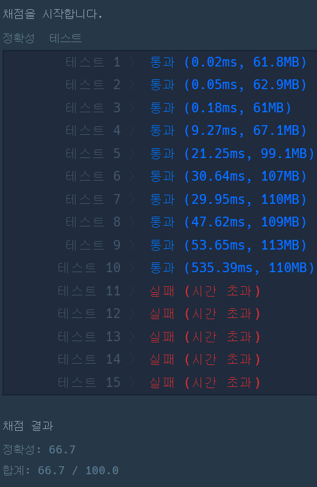

> 최초작성 : 2022.10.19

# ******Level2 - 풍선 터트리기****(kotlin)**

 [코딩테스트 연습 - 풍선 터트리기](https://school.programmers.co.kr/learn/courses/30/lessons/68646)

## 문제 설명
일렬로 나열된 n개의 풍선이 있습니다. 모든 풍선에는 서로 다른 숫자가 써져 있습니다. 당신은 다음 과정을 반복하면서 풍선들을 단 1개만 남을 때까지 계속 터트리려고 합니다.

	1. 임의의 인접한 두 풍선을 고른 뒤, 두 풍선 중 하나를 터트립니다.
	2. 터진 풍선으로 인해 풍선들 사이에 빈 공간이 생겼다면, 빈 공간이 없도록 풍선들을 중앙으로 밀착시킵니다.

여기서 조건이 있습니다. 인접한 두 풍선 중에서 번호가 더 작은 풍선을 터트리는 행위는 최대 1번만 할 수 있습니다. 즉, 어떤 시점에서 인접한 두 풍선 중 번호가 더 작은 풍선을 터트렸다면, 그 이후에는 인접한 두 풍선을 고른 뒤 번호가 더 큰 풍선만을 터트릴 수 있습니다.

당신은 어떤 풍선이 최후까지 남을 수 있는지 알아보고 싶습니다. 위에 서술된 조건대로 풍선을 터트리다 보면, 어떤 풍선은 최후까지 남을 수도 있지만, 어떤 풍선은 무슨 수를 쓰더라도 마지막까지 남기는 것이 불가능할 수도 있습니다.

일렬로 나열된 풍선들의 번호가 담긴 배열 a가 주어집니다. 위에 서술된 규칙대로 풍선들을 1개만 남을 때까지 터트렸을 때 최후까지 남기는 것이 가능한 풍선들의 개수를 return 하도록 solution 함수를 완성해주세요.

## 제한 조건
* a의 길이는 1 이상 1,000,000 이하입니다.
    * a[i]는 i+1 번째 풍선에 써진 숫자를 의미합니다.
    * a의 모든 수는 -1,000,000,000 이상 1,000,000,000 이하인 정수입니다.
    * a의 모든 수는 서로 다릅니다.


## ​입출력 예 
| a                                     | result |
|---------------------------------------|--------|
| [9,-1,-5]                             | 3      |
| [-16,27,65,-2,58,-92,-71,-68,-61,-33] | 6      |

### 입출력 예 설명

#### **입출력 예 #1**
	• 첫 번째 풍선(9가 써진 풍선)을 최후까지 남기는 방법은 다음과 같습니다.
		1) [9, -1, -5] 에서 -1, -5가 써진 풍선을 고른 뒤, -1이 써진 풍선(번호가 더 큰 것)을 터트립니다.
		2) [9, -5] 에서 9, -5가 써진 풍선을 고른 뒤, -5가 써진 풍선(번호가 더 작은 것)을 터트립니다.
	• 두 번째 풍선(-1이 써진 풍선)을 최후까지 남기는 방법은 다음과 같습니다.
		1) [9, -1, -5] 에서 9, -1이 써진 풍선을 고른 뒤, 9가 써진 풍선(번호가 더 큰 것)을 터트립니다.
		2) [-1, -5] 에서 -1, -5가 써진 풍선을 고른 뒤, -5가 써진 풍선(번호가 더 작은 것)을 터트립니다.
	• 세 번째 풍선(-5가 써진 풍선)을 최후까지 남기는 방법은 다음과 같습니다.
		1) [9, -1, -5] 에서 9, -1이 써진 풍선을 고른 뒤, 9가 써진 풍선(번호가 더 큰 것)을 터트립니다.
		2) [-1, -5] 에서 -1, -5가 써진 풍선을 고른 뒤, -1이 써진 풍선(번호가 더 큰 것)을 터트립니다.
	• 3개의 풍선이 최후까지 남을 수 있으므로, 3을 return 해야 합니다.


#### **입출력 예 #2**
	• 최후까지 남을 수 있는 풍선은 -16, -92, -71, -68, -61, -33이 써진 풍선으로 모두 6개입니다.

<br>

---


## _**나의 풀이 : 첫번째 (실패)**_

1\. 두개의 인접한 풍선을 터트리려고 할 때, '작은값'을 터트리는 경우는 '한 번'만 가능하다.

2\. (1)을 토대로 유추할 수 있는 것은 나를 기준으로 양쪽을 비교할 때, 나보다 작은 값이 한 쪽에만 몰려있어야 한다.

3\. Filter를 통해 양쪽 리스트를 구하고 최솟값을 구하니 시간 초과 오류가 났다.

4\. 시간을 줄이기 위해 left의 최솟값을 가장 큰 수인 1000000으로 놓고, right에서 하나씩 넘어올 때 값을 비교하여 갱신하도록 했다.

5\. Right의 최솟값은 left에 넘어가거나 자기자신일 수 있는 변동 사항이 많아 나보다 최솟값이 있는 경우 바로 return 시키도록 했다.

6\. 이 경우, 11번부터 시간초과 오류가 난다.

```kt
fun solution(a: IntArray): Int {
	var answer = 0
	var leftMin = 1000000000

	a.forEachIndexed { index, i ->
		when (index) {
			0, a.size - 1 -> answer++
			else -> {
				if (a[index-1] < leftMin) leftMin = a[index-1]
				
				if (leftMin > i) answer ++
				else {
					var isMin = true
					for (x in index+1 until a.size) {
						if (a[x] < i) {
							isMin = false
							break
						}
					}
					
					if (isMin) answer++
				}
			}
		}
	}

	return answer
}

```

위 방법으로 문제를 풀면 시간초과 오류가 난다.



<br>

## _**나의 풀이 : 두번째 (성공)**_

1\. 두개의 인접한 풍선을 터트리려고 할 때, '작은값'을 터트리는 경우는 '한 번'만 가능하다.

2\. (1)을 토대로 유추할 수 있는 것은 나를 기준으로 양쪽을 비교할 때, 나보다 작은 값이 한 쪽에만 몰려있어야 한다.

3\. left의 최솟값을 가장 큰 수인 1000000으로 놓고, right에서 하나씩 넘어올 때 값을 비교하여 갱신하도록 했다.

4\. Right의 최솟값을 가장 큰 수인 1000000으로 놓고, left에서 하나씩 넘어올 때 값을 비교하여 갱신하도록 했다.

5\. 3번과 4번을 같은 for문 안에서 동시에 진행하였고, 최솟값이 자신보다 작으면 해당 위치에 배열을 false로 변경하였다.

6\. 각 index에서 하나라도 true가 있으면 터트릴 수 있는 풍선이다.

아래표를 보면 간단하게 이해될 것이다.

|      | -16 | 27 | 65 | -2 | 58 | -92 | -71 | -68 | -61 | -33 |
|------|-----|----|----|----|----|-----|-----|-----|-----|-----|
| 왼   | T   | F  | F  | F  | F  | T   | F   | F   | F   | F   |
| 오   | F   | F  | F  | F  | F  | T   | T   | T   | T   | T   |
| 결과 | T   | F  | F  | F  | F  | T   | T   | T   | T   | T   |

* 왼쪽 값에서 나보다 작은 값이 있으면 F이다.
* 오른쪽 값에서 나보다 작은 값이 있으면 F이다.
* 둘 중 한쪽이라도 T이면 터트릴 수 있는 풍선이다.

```kt
fun solution(a: IntArray): Int {
	var answer = 0
	var leftMin = 1000000000

	a.forEachIndexed { index, i ->
		when (index) {
			0, a.size - 1 -> answer++
			else -> {
				if (a[index-1] < leftMin) leftMin = a[index-1]
				
				if (leftMin > i) answer ++
				else {
					var isMin = true
					for (x in index+1 until a.size) {
						if (a[x] < i) {
							isMin = false
							break
						}
					}
					
					if (isMin) answer++
				}
			}
		}
	}

	return answer
}

```

이 방법으로 생각이 도달하기까지 꽤 힘들었다.<br>
left 최솟값을 찾는건 잘했다고 생각했는데 right 최솟값에서 애를 먹었다.<br>
'동시에 구해야한다' 라는 생각에 매몰되어서 그랬던 것 같다.<br>
차근차근 표를 그리면서 생각하니 생각이 정리되며 아이디어가 떠올랐다.